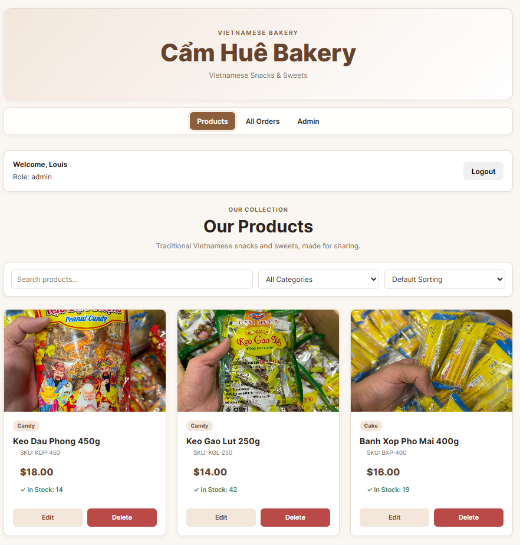
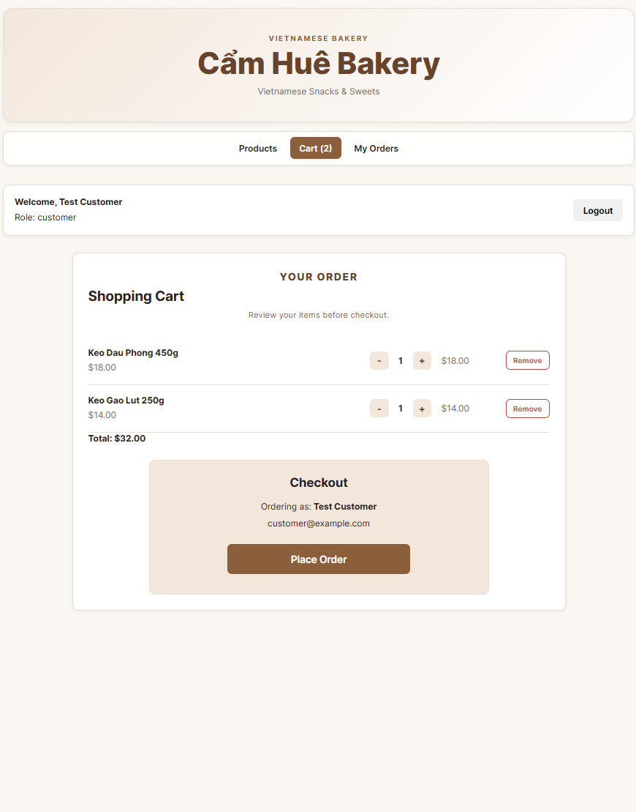
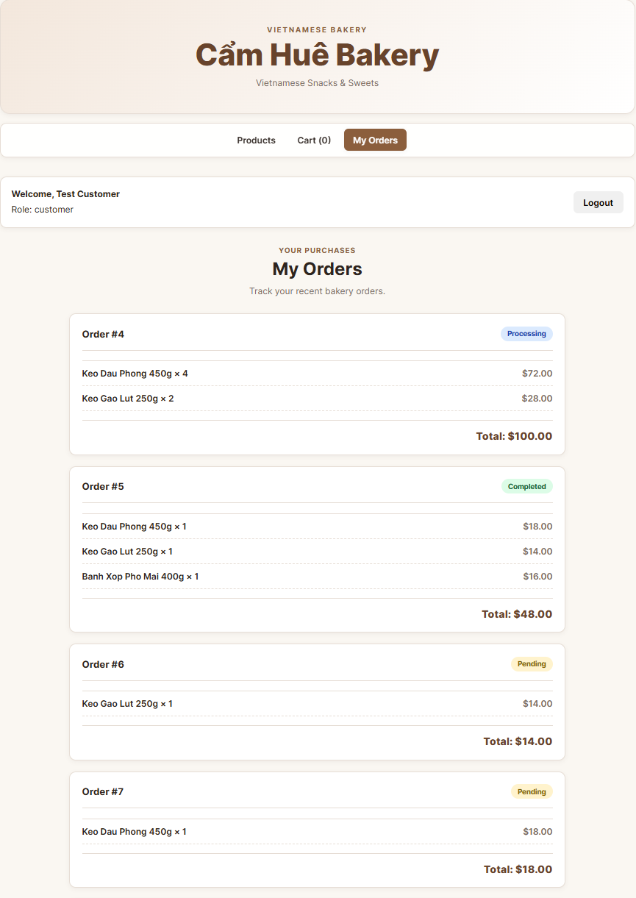
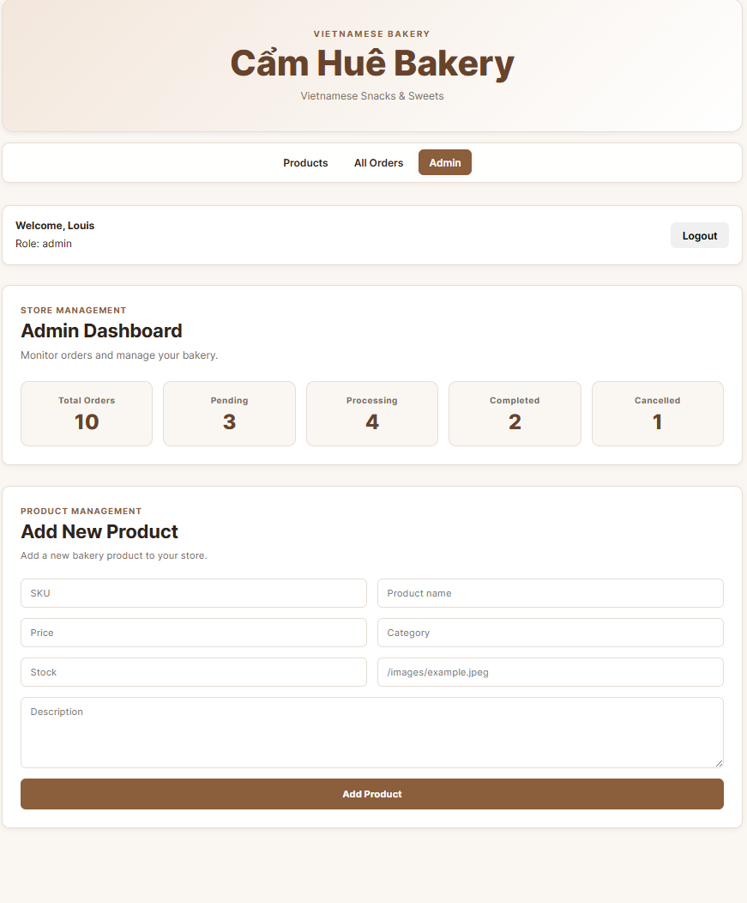
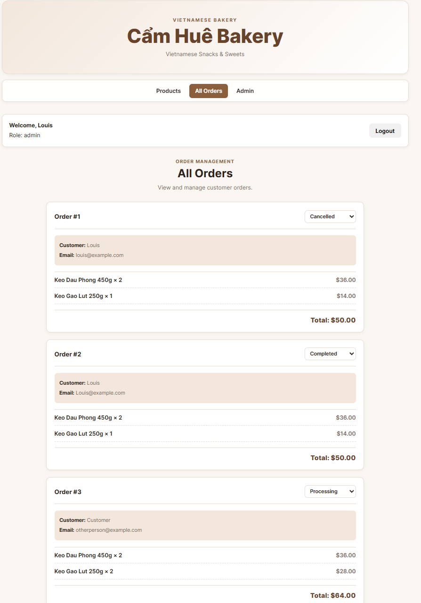
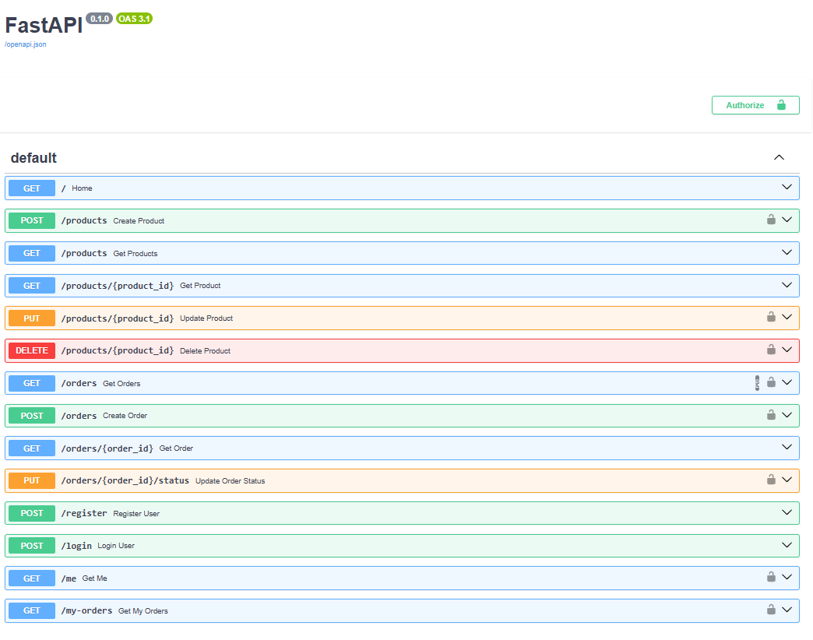

# Cẩm Huê Bakery Sales App

A full-stack bakery e-commerce application for selling Vietnamese snacks and sweets.

## Screenshots

### Product Storefront

Browse Vietnamese bakery products with search, category filtering, sorting, stock information, and cart functionality.



### Customer Registration

Customers can create an account before placing and tracking orders.


### Shopping Cart

Customers can manage their selected products and proceed to checkout.



### Customer Order History

Customers can view their previous orders and track order status.



### Admin Dashboard

Administrators can monitor order statistics and manage bakery products.



### Admin Order Management

Administrators can view customer orders and update their status.



### FastAPI Documentation

The backend provides interactive Swagger API documentation through FastAPI.



## Features

### Customer

- Register and login
- Browse bakery products
- Search, filter, and sort products
- Add products to cart
- Update quantities and remove cart items
- Checkout and place orders
- View personal order history
- Responsive mobile interface

### Admin

- Admin dashboard
- View all customer orders
- Update order status
- Add products
- Edit products
- Delete products
- Manage product inventory

## Tech Stack

### Backend

- Python
- FastAPI
- SQLAlchemy
- SQLite
- JWT Authentication
- Pydantic
- python-dotenv

### Frontend

- React
- Vite
- React Router
- CSS
- Fetch API

## Project Structure

```text
Bakery_Sales_App/
├── main.py
├── models.py
├── schemas.py
├── crud.py
├── database.py
├── security.py
├── requirements.txt
├── .env.example
├── README.md
└── frontend/
    ├── src/
    ├── public/
    ├── package.json
    └── .env.example
```

## Status

The application currently includes product management, shopping cart, authentication, checkout, order management, admin tools, responsive design, and production environment configuration.

## Installation & Setup

### 1. Clone the Repository

```bash
git clone <your-repository-url>
cd Bakery_Sales_App
```

> Replace `<your-repository-url>` with the GitHub repository URL after the repository is published.

### 2. Backend Setup

Create a Python virtual environment:

```bash
python -m venv .venv
```

Activate the virtual environment on Windows PowerShell:

```powershell
.\.venv\Scripts\Activate.ps1
```

Install backend dependencies:

```bash
python -m pip install -r requirements.txt
```

Create a backend `.env` file based on `.env.example`:

```env
SECRET_KEY=your-secret-key-here
ALGORITHM=HS256
ACCESS_TOKEN_EXPIRE_MINUTES=60
DATABASE_URL=sqlite:///./bakery.db
FRONTEND_ORIGINS=http://localhost:5173,http://127.0.0.1:5173
```

Generate a secure JWT secret:

```bash
python -c "import secrets; print(secrets.token_hex(32))"
```

Copy the generated value into `SECRET_KEY` in your `.env` file.

Start the FastAPI backend:

```bash
python -m uvicorn main:app --reload
```

Backend:

```text
http://127.0.0.1:8000
```

Interactive API documentation:

```text
http://127.0.0.1:8000/docs
```

### 3. Frontend Setup

Open a second terminal:

```bash
cd frontend
npm install
```

Create `frontend/.env` based on `frontend/.env.example`:

```env
VITE_API_URL=http://127.0.0.1:8000
```

Start the React development server:

```bash
npm run dev
```

Frontend:

```text
http://localhost:5173
```

### 4. Production Build

From the `frontend` directory:

```bash
npm run build
```

Preview the production build locally:

```bash
npm run preview
```

## API Overview

FastAPI provides interactive API documentation at:

```text
http://127.0.0.1:8000/docs
```

### Authentication

| Method | Endpoint | Description |
| --- | --- | --- |
| POST | `/register` | Create a customer account |
| POST | `/login` | Login and receive a JWT access token |
| GET | `/me` | Get the currently authenticated user |

Protected endpoints use:

```text
Authorization: Bearer <access_token>
```

### Products

| Method | Endpoint | Description |
| --- | --- | --- |
| GET | `/products` | Get products with search, filter, sort, and pagination |
| GET | `/products/{product_id}` | Get a single product |
| POST | `/products` | Create a product (Admin) |
| PUT | `/products/{product_id}` | Update a product (Admin) |
| DELETE | `/products/{product_id}` | Delete a product (Admin) |

### Orders

| Method | Endpoint | Description |
| --- | --- | --- |
| POST | `/orders` | Place a new order |
| GET | `/my-orders` | View the current customer's orders |
| GET | `/orders` | View all customer orders (Admin) |
| GET | `/orders/{order_id}` | Get a single order |
| PUT | `/orders/{order_id}/status` | Update an order status (Admin) |

### Order Status

Supported order statuses:

```text
pending
processing
completed
cancelled
```

## Authentication & Authorization

The application uses JWT-based authentication.

There are two user roles:

- `customer` — can browse products, manage a cart, checkout, and view personal orders.
- `admin` — can manage products and customer orders.

Passwords are stored as password hashes rather than plain-text passwords.

Admin-only backend endpoints are protected by role-based authorization.

## Environment Variables

Backend variables are documented in:

```text
.env.example
```

Frontend variables are documented in:

```text
frontend/.env.example
```

Real `.env` files are excluded from Git and should never contain secrets committed to the repository.

## Future Improvements

Potential future improvements include:

- Online payment integration
- Product image upload/storage
- Production database
- Deployment
- Automated testing
- Improved order tracking

## What I Learned

This project helped me practice building a full-stack application from backend to frontend, including:

- Designing REST APIs with FastAPI
- Working with SQLAlchemy and relational database models
- Implementing CRUD operations
- Building JWT authentication and role-based authorization
- Connecting a React frontend to a FastAPI backend
- Managing application state and shopping cart functionality
- Building customer and admin workflows
- Handling loading, error, and empty states
- Creating responsive layouts for desktop and mobile
- Using environment variables for development and production configuration
- Preparing and testing a production build

## Author

Built as a full-stack learning and portfolio project.